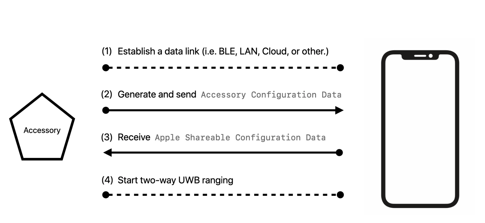
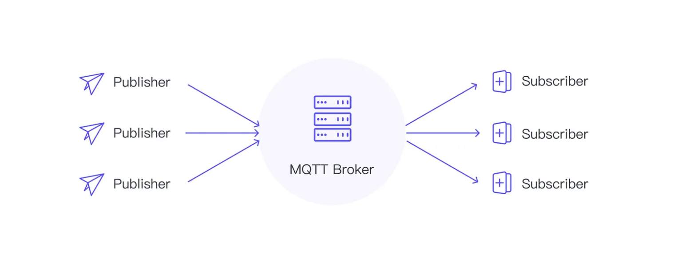

# Smartlight_UWB

Smartlight_UWB is a system which is using Ultra Wideband technology ranging to perform indoor localization and turn on the light when I enter the room and turn it off when I leave. 
Ultra Wideband is a cutting-edge wireless technology that offers exceptional precision for locating and communicating with devices. Unlike traditional radio technologies like Wi-Fi and Bluetooth, UWB operates at extremely high frequencies and utilizes short, precise pulses to transmit data. This enables UWB to achieve centimeter-level accuracy in positioning and precise timing synchronization.

UWB's unique capabilities hold immense potential for various applications, including:

- Precision indoor positioning
- Secure keyless entry
- Automotive sensing and control
- Precision time synchronization

Hardware used in above project is:
- [DWM3001CDK](https://www.qorvo.com/products/p/DWM3001CDK)
- [Raspberry Pi Zero](https://www.raspberrypi.com/products/raspberry-pi-zero/)
- [iPhone 12 Pro](https://support.apple.com/kb/SP831?locale=pl_PL)

In this project I used [SDK](https://www.qorvo.com/products/p/DWM3001CDK#evaluation-tools) developed and maintained by Qorvo manufacture, what enables in easier development of application. Additionaly with tools from [Segger](https://segger.com/) like for e.g. j-Flash, and apple Xcode

## How it works?

At the beginning iOS device establish a two-way data link to the accessory. The data link must be capable of facilitating the exchange of configuration data as defined in this specification, as well as handling any additional application-specific communications — e.g., starting and stopping interaction, error recovery and state synchronization.

Next is to establish connection with MQTT broker on raspberryPi and iOS device which for project purpouses I used localy manager broker by [MQTTX](https://mqttx.app/). DWM30001CDK is sending the information about distance throught UWB to iOS device wchih nextly is passing those data to raspberryPi throught MQTT. I used above solution because on rPi It has a lot of GIPO pinout so I can control easily things like light, keyless entry etc.

## Getting Started 